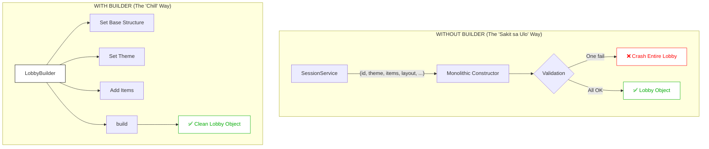
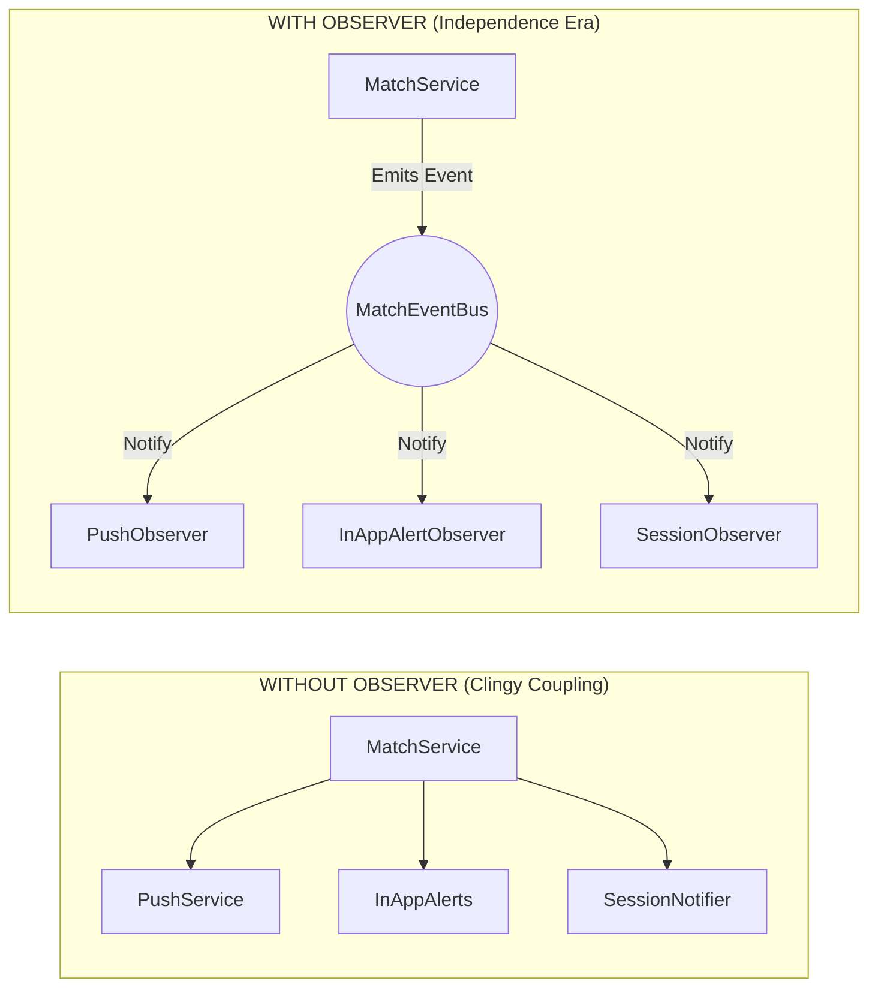
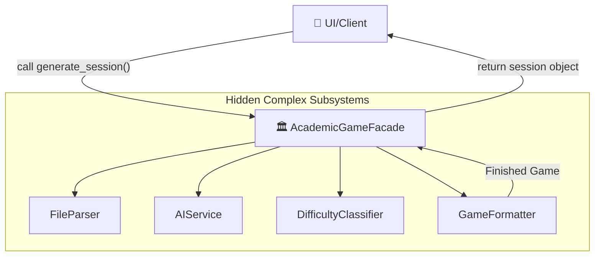

# Connect.Tayo
### *Where matching begins not with a look, but with a shared adventure.*

---

## Table of Contents

- [A. App Summary](#-app-summary)
- [B. Design Pattern Implementations](#-design-pattern-implementations)
  - [Creational: Builder (Bob the Bridge Builder)](#creational--builder-persistent-shared-lobby-construction)
  - [Behavioral: Observer (Love and Subscribe)](#behavioral--observer-notification-system)
  - [Structural: Facade (It’s Complicated)](#structural--facade-academic-game-generation-pipeline)

---
## A. App Summary

### Overview
**Connect.Tayo** is a gamified, activity-centric matchmaking application for the University of the Philippines Visayas (UPV). It replaces traditional platforms that may prioritize visual aesthetics and first impressions. Connect.Tayo focuses more on creating a shared experience in a structured environment that focuses on intellectual and recreational compatibility between users. 

### Audience
The application is exclusively for UPV students that has a hard time connecting through abrupt social interactions and first impressions. It provides students a way to bond together and uncover innate characteristics through the structured environment fostering relationship built with experience rather than surface-level connections.

### The Twist: No Chat Until You Play
Unlike conventional dating apps where a match opens a direct message channel, Connect.Tayo provides the ability to propose a synchronized gaming session. Only when both users log in at their agreed time does a private real-time environment open between them allowing them to engage in gaming activities that foster bonds and relationships.

### User Profiles

Profiles in Connect.Tayo will compose of college degrees, year level, current courses, and study habits. Additionally it can also display typical online or active hours, preferred game genre, and gaming  completion rates to help identify and match proper game activities.

### Matching & Scheduling
Swiping in Connect.Tayo will do the following:

1. A mutual right swipe unlocks the ability to *propose* a session for the synchronized gaming session
2. A user proposes three available time slots from their calendar, and the pair will accept one to confirm the session

If a user misses the session or remains inactive for more than five minutes after joining, the session automatically terminates. This mechanism should provide a way to prevent ghosting, and it also discourages low-effort matching.

### The Private Game Session

Once both users connect at the agreed time, they enter a **persistent shared world** divided into three environments:

- **Virtual Lobby:** A cozy and customizable private space that serves as the home base between gaming activities for introductions, hardware setup and session mode selections. This lobby is unique to each pair and can be modified through engaging with more sessions together, accumulating decorational items, unlocking themes which reflect their shared history.

- **Entertainment Mode:** Real-time cooperative mini-games designed to test mutual problem-solving, real-time communication, and stress management under playful pressure.
    - Synchronized Puzzle-Solving: Work together and collaborate in solving games that requires simultaneous input and partner coordination.
    - Digital Escape Rooms: Venture through various narrative-driven environments that demand clear communication and logic to escape within a time limit.
    - Co-op platformer game: Partner up and venture through a high stakes environment that needs collaboration and human connection.

- **Academic Mode:** AI-powered, learning centered games that are generated from uploaded academic resources such as lecture slides, PDF documents or handwritten notes that minimizes setup burden while enabling collaborative studying.
    - Co-op Trivias: Simulate a trivia night and work together in answering various trivia questions generated from common lessons.
    - Digital Quiz bee: This high pressure game lets users answer questions within a time limit.
    - Impromptu challenge: Describe a topic selected by the AI within a limited time and let it provide ratings.

### Reward Economy
Completing sessions yields in-app credits based on game difficulty and user performance. Users can spend these credits on personal customization (e.g. character appearance, clothes, accessories) or digital lobby assets (e.g. decorations, themes, music) transforming the space into a reflection of interactions.

---

## B. Design Pattern Implementations


### Creational

#### I. Name of Pattern: **Builder Pattern** (Applied to: Persistent Shared Lobby Construction)


#### II. Concept in Conyo: 
“Bob the Bridge Builder” · Lobby / Room Construction

Ang Builder ang maghahandle ng creation ng rooms/lobby kung gusto mo ma optimize ang creation ng lobbies/rooms by having set blueprints na using yung mga accessories na you get from the currency na makukuha mo, so pwede mo na ma set already yung design and yung builder ang magcre-create by just creating the lobby preset before kayo mag meetup ng your possible true love.

#### III. Visual Diagram:

---

#### IV. Why It Works:
**❌ Without Builder**
- Isang malaking constructor that handles everything.
- Pag-fail ng isa, bumabagsak lahat. Kung hindi ma-load yung isang accessory mo ay game over, walang lobby. No fallback, walang recovery.
- Copy-paste nightmare. So when may maraming function ka that handles this function, Bawat bago customization, dapat mo i-update mo lahat ng places.
- Walang readability. Constructor na may 10+ arguments, it’s easy to forget na yung 7th argument na kailan for the function, wala kasing self-documentation.

**✅ With Builder**
- Step-by-step, naka-blueprint na lahat that is needed.
- Graceful fallback per component. Pag may accessory na hindi ma-load, that step lang ang may issue na nag-default to safe value, nagpatuloy ang build. Hindi bumabagsak ang buong lobby.
- Single source of construction. Isang function na yung mag-hahandle sa sequence. Other functions just request what they needed, hindi na kailangan malaman kung paano ito ginawa.
- Self-documenting siya. Alam mo agad what does a step do. If mag-add ng new customization, one class lang ang magbabago.


#### V. Pseudocode:

```
PSEUDOCODE (What happens INSIDE the builder):
----------------------------------------------
CLASS LobbyBuilder:
    FUNCTION __init__():
        self.lobby = new Lobby()
    
    FUNCTION set_base_structure(pairId):
        self.lobby.baseRoom = loadBaseRoom(pairId)
        RETURN self
        
    FUNCTION set_theme(themeId):
        self.lobby.theme = loadTheme(themeId) OR DefaultTheme
        RETURN self
        
    FUNCTION add_items(itemIds):
        FOR EACH id IN itemIds:
            item = loadItem(id)
            IF item EXISTS:
                self.lobby.items.append(item)
        RETURN self
        
    FUNCTION build():
        VALIDATE lobby.baseRoom IS NOT NULL
        RETURN self.lobby
```
---

### Behavioral 

#### I. Name of Pattern: **Observer Pattern** (Applied to: App-Wide Notification System)

#### II. Concept in Conyo: 

“Love and Subscribe” · Match & Lobby Notifications

Observer will be used sa pag notify ng user kung when andyan na sa lobby yung ka-match nya, kasi sa scenario nato assumed na nga if mutuals kayo subscribed kana sa notification na isesend sayo kung mag open na yung lobby and one of you entered the room, gagamitin din yan when you want to be informed when may tao na interested sayo, so kahit you both are still not mutual you will be informed para mas mabilis yung process ng paghahanap ng ka-mutual.


#### III. Visual Diagram



#### IV. Why It Works

**❌ Without Observer**
- Bawat service, manually calling lahat ng dapat na handlers.
- Web of tight dependencies. Pag may bagong notification channel (e.g. sound cue, email digest) kailangan i-update ang every service na nag-emit ng event. Para lang talaga sa isang bagong feature, dami na yung affected files.
- Hindi dapat trabaho ng service yun. Some function kukuha ng job na hindi naman sa kanila like kung may ScheduleService, hindi sya dapat yung mag-notify. That's not his job, focus lang siya dapat sa scheduling logic.
- Easy to forget, hard to audit. Add lang ng bagong event type, manually mo pa hahanapin kung sino dapat ang mag-receive. Madaling may malilimutan, tapos may mag-report ng missed notification.

**✅ With Observer**
- Mag-emit ka lang, si Observer na ang bahala.
- Single responsibility per service. We have of different functions? Mag emit lng sila sa event bus ng chosen event. Tapos, proceed. Hindi na nila ine-entertain kung sino ang nag-listen.
- Plug-and-play notification channels. To add ng bagong method of notifications, gawa ka lang ng bagong observer, i-register sa bus, and done. Zero changes sa existing services.
- Open for extension, closed for modification. Hindi nagmo-move and already existing codes. Ang bago lang ang nadadagdag, mas safe na and mas scalable pa.

#### V. Pseudocode
```
PSEUDOCODE (Observer):
-----------
CLASS MatchEventBus:
    LIST observers = []
    FUNCTION attach(observer):
        ADD observer to observers list
    FUNCTION detach(observer):
        REMOVE observer from observers list
    FUNCTION notify(event):
        FOR EACH observer in observers:
            CALL observer.update(event)

CLASS PushNotificationObserver:
    FUNCTION update(event):
        // Send a ping to the user's phone
        IF event.type == "MATCH":
            SEND "You found a partner!"

CLASS InAppAlertObserver:
    FUNCTION update(event):
        // Show a cute toast message inside the app
        IF event.type == "SESSION_STARTING":
            SHOW "Your partner is waiting in the lobby!"

CLASS SessionObserver:
    FUNCTION update(event):
        // React to session-specific lifecycle events
```

---

### Structural 

#### I. Name of Pattern **Facade Pattern** (Applied to: Academic Mode Game Generation Pipeline)

#### II. Concept in Conyo
“It's Complicated” · Entertainment Mode / Academic Game Generation

Facade yung ginamit when magsimula ang “Entertainment Mode”, it makes it easy para sa system to just accept let’s say yung mga files na binigay nyo and then tatawag lang yung system ng function that will generate the game mula sa files na binigay mo, so yung generate game na yung nag hahandle ng complexity ng reading files nyo, calling the respective functions, and kung anong game yung iplay nyo ng ka-match mo.

#### III. Visual Diagram

---

#### IV. Why It Works
**❌ Without Facade**
- Client nag-o-orchestrate ng buong pipeline
- Client naging project manager ng lahat. File parser, AI service, response parser, difficulty classifier, game formatter, so many subsystems na lahat ay tinatawagan ng client. Daming explicit din na dependencies bago ka makalaro ng isang game.
- Internal changes ripple outward. Pag nag-switch ka ng AI provider, yung client code needs to change. Bagong game mode, kailangan ng client to learn the new pipeline branch. Lahat ng changes, apektado talaga si client. 
- Error handling sa bawat step. Each subsystem mag try and catch para lang ma check ang errors. Ang client code ay nagiging error management code na lang, hindi application logic.

**✅ With Facade**
- Isang function call lang, isang tawag everything set up.
- One method call, full game session. For example generate_session(file, gameMode), yun lang ang kailangan ng client. Other na ang nag-orchestrate ng lahat internally.
- All complexity stays inside. Error handling, retry logic, pipeline branching, lahat ng ito nasa Facade. Hindi ito nakikita ng client. Mas malinis at mas maintainable.
- Extensible without breaking clients. Kung may bagong game mode sa Facade mo na I-implement. Yung gameMode parameter routes internally na, same clean API, bagong experience. Client interface, Hindi nagbabago.


#### V. Pseudocode

```
PSEUDOCODE (Facade):
-----------
CLASS AcademicGameFacade:
    CONSTRUCTOR:
        self.parser = FileParser()
        self.ai = AIService()
        self.scorer = DifficultyClassifier()
        self.formatter = GameFormatter()

    FUNCTION generate_session(file, gameMode):
        // Step 1: Get text from PDF/Notes
        raw_text = self.parser.extract_text(file)
        
        // Step 2: Generate questions using AI
        questions = self.ai.generate_questions(raw_text, gameMode)
        
        // Step 3: Grade the difficulty
        scored_questions = self.scorer.classify(questions)
        
        // Step 4: Package it for the game engine
        session_object = self.formatter.format_as_game(scored_questions)
        
        RETURN session_object
```

---


